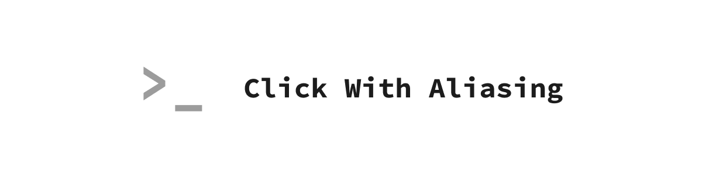

# Click With Aliasing


TBD

## Features

TBD

## Installation

```bash
pip install click-with-aliasing
```

## Contributing

Contributions are welcome! Please read our [contributing guide](CONTRIBUTING.md) for details on our development process, coding standards, and how to submit pull requests.

## License

This project is licensed under the MIT License. See the [license file](LICENSE) for details.

## Acknowledgments

Built on top of the great [Click](https://click.palletsprojects.com/) library by the Pallets team by [these authors](AUTHORS.md).
